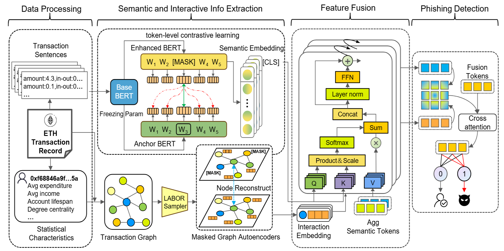

# Ethereum Fraud Detection--LMAE4Eth
This is an implementation of the paper - "LMAE4Eth: Generalizable and Robust Ethereum Fraud Detection by Exploring Transaction Semantics and Masked Graph Embedding"
## Overview
As Ethereum confronts increasingly sophisticated fraud threats, recent research seeks to improve fraud account detection by leveraging advanced pre-trained Transformer or self-supervised graph neural network. However, current Transformer-based methods rely on context-independent, numerical transaction sequences, failing to capture semantic of account transactions. Furthermore, the pervasive homogeneity in Ethereum transaction records renders it challenging to learn discriminative account embeddings. Moreover, current self-supervised graph learning methods primarily learn node representations through graph reconstruction, resulting in suboptimal performance for node-level tasks like fraud account detection, while these methods also encounter scalability challenges.

To tackle these challenges, we propose LMAE4Eth, a multi-view learning framework that fuses transaction semantics, masked graph embedding, and expert knowledge. We first propose a transaction-token contrastive language model (TxCLM) that transforms context-independent numerical transaction records into logically cohesive linguistic representations, and leverages language modeling to learn transaction semantics. To clearly characterize the semantic differences between accounts, we also use a token-aware contrastive learning pre-training objective, which, together with the masked transaction model pre-training objective, learns high-expressive account representations. We then propose a masked account graph autoencoder (MAGAE) using generative self-supervised learning, which achieves superior node-level account detection by focusing on reconstructing account node features rather than graph structure. To enable MAGAE to scale for large-scale training, we propose to integrate layer-neighbor sampling into the graph, which reduces the number of sampled vertices by several times without compromising training quality. Additionally, we initialize the account nodes in the graph with expert-engineered features to inject empirical and statistical knowledge into the model. Finally, using a cross-attention fusion network, we unify the embeddings of TxCLM and MAGAE to leverage the benefits of both. We evaluate our method against 15 baseline approaches on three datasets. Experimental results show that our method outperforms the best baseline by over 10% in F1-score on two of the datasets. Furthermore, we observe from three datasets that the proposed method demonstrates unprecedented generalization ability compared to previous work. 
## Model Designs



## Requirementse

```
- Python (>=3.8.10)
- Pytorch (>2.3.1)
- Numpy (>=1.24.4)
- Pandas (>=1.4.4)
- Transformers (2.0.0)
- Scikit-learn (>=1.1.3)
- dgl (>=2.0.0)
- Gensim (>=4.3.2)
- Scipy (>=1.10.1)
```

## Dataset

We evaluated the performance of the model using two publicly available and newly released datasets. The composition of the dataset is as follows, you can click on the **"Source"** to download them.

| *Dataset*        | *Nodes*      | *Edges*       | *Avg Degree*   |*Phisher* | *Source*  |
| ---------------- | ------------- | -------------- | -------------- |------- |---------- |
| MultiGraph       |  2,973,489    |  13,551,303    |  4.5574        | 1,165  |  XBlock     |
| B4E              |  597,258      |  11,678,901    |  19.5542       | 3,220  |  Google Drive   |
| SPN  |  496,740      |  1831,082      |  1.6730        | 5,619  |    Github       |


## Main Results

For more information, please refer to the paper.
| Method       | **MulDiGraph** Precision | **MulDiGraph** Recall | **MulDiGraph** F1 | **MulDiGraph** BAcc | **B4E** Precision | **B4E** Recall | **B4E** F1 | **B4E** BAcc | **SPN** Precision | **SPN** Recall | **SPN** F1 | **SPN** BAcc |
|--------------|--------------------------|-----------------------|-------------------|---------------------|-------------------|----------------|------------|--------------|-------------------|----------------|------------|--------------|
| DeepWalk     | 0.5821                   | 0.5867                | 0.5844            | 0.6880              | 0.6358            | 0.6495         | 0.6426     | 0.7317       | 0.5213            | 0.5119         | 0.5166     | 0.6384       |
| Role2Vec     | 0.4688                   | 0.6976                | 0.5608            | 0.6511              | 0.5748            | 0.7958         | 0.6673     | 0.7507       | 0.4521            | 0.7059         | 0.5512     | 0.6391       |
| Trans2Vec    | 0.7114                   | 0.6944                | 0.7029            | 0.7768              | 0.2634            | 0.7043         | 0.3842     | 0.3598       | 0.3928            | 0.7381         | 0.5134     | 0.5838       |
| GCN          | 0.2960                   | 0.7513                | 0.4247            | 0.4289              | 0.5515            | 0.7508         | 0.6359     | 0.7228       | 0.5046            | 0.4973         | 0.5009     | 0.6266       |
| GAT          | 0.2689                   | 0.7917                | 0.4014            | 0.3577              | 0.4729            | **0.8348**     | 0.6038     | 0.6848       | 0.5083            | 0.7720         | 0.6130     | 0.6993       |
| GSAGE        | 0.3571                   | 0.3299                | 0.3430            | 0.5164              | 0.4589            | 0.5826         | 0.5134     | 0.6196       | 0.4557            | 0.5817         | 0.5110     | 0.6172       |
| DiffPool     | 0.6475                   | 0.5767                | 0.6101            | 0.7099              | 0.5767            | 0.5058         | 0.5389     | 0.6601       | 0.5592            | 0.5103         | 0.5336     | 0.6546       |
| U2GNN        | 0.6218                   | 0.6074                | 0.6145            | 0.7113              | 0.6236            | 0.5712         | 0.5963     | 0.6994       | 0.5766            | 0.5311         | 0.5529     | 0.6681       |
| Graph2Vec    | 0.8293                   | 0.4359                | 0.5714            | 0.6955              | 0.7714            | 0.4761         | 0.5888     | 0.7028       | **0.7951**        | 0.4452         | 0.5708     | 0.6939       |
| TSGN         | **0.8544**               | 0.5712                | 0.6847            | 0.7613              | 0.6233            | 0.8168         | **0.7071**  | **0.7850**   | 0.7389            | 0.5128         | 0.6054     | 0.7111       |
| GrabPhisher  | 0.7146                   | **0.8472**            | **0.7753**        | **0.8390**          | **0.8083**        | 0.5931         | 0.6842     | 0.7614       | 0.6760            | **0.8059**     | **0.7353** | **0.8064**   |
| GAE          | 0.3728                   | 0.5447                | 0.4426            | 0.5432              | 0.4239            | 0.5623         | 0.4834     | 0.5901       | 0.4077            | 0.3692         | 0.3875     | 0.5505       |
| GATE         | 0.3430                   | 0.7138                | 0.4633            | 0.5151              | 0.4680            | 0.7191         | 0.5670     | 0.6552       | 0.6154            | 0.7376         | 0.6710     | 0.7536       |
| BERT4ETH     | 0.4469                   | 0.7344                | 0.5557            | 0.6400              | 0.7421            | 0.6125         | 0.6711     | 0.7530       | 0.7566            | 0.6713         | 0.7114     | 0.7817       |
| ZipZap       | 0.4537                   | 0.7298                | 0.5595            | 0.6452              | 0.7374            | 0.6132         | 0.6696     | 0.7520       | 0.7539            | 0.6682         | 0.7084     | 0.7796       |
| **Ours**     | **0.9024**               | **0.8889**            | **0.8960**        | **0.9204**          | **0.7903**        | **0.8397**     | **0.8143**  | **0.8641**   | **0.8123**        | **0.7885**     | **0.8002** | **0.8487**   |
| **Improv. (%)** | 4.8                    | 4.17                  | 12.07             | 8.14                | -1.8              | 0.49           | 10.72      | 7.91         | 1.72              | -1.74          | 6.49       | 4.23         |

